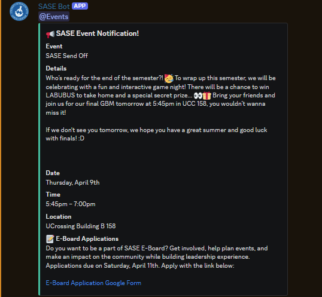
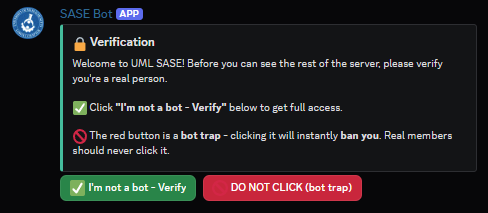

# SASE-Bot

## Screenshots

A Discord bot built for the UMass Lowell SASE chapter to automate event 
operations and member engagement.

## Features
- 📢 Parses Campus Groups event emails via Gmail IMAP and posts structured announcements
- 📅 Auto-creates Discord Scheduled Events from parsed email data
- ✅ Forum-based task board with slash/prefix command support
- 🔒 Member verification gate with bot-trap spam protection
- 🎭 Role-based notification opt-in (Events, Instagram, major, grad year, alumni)
- 🎂 Birthday announcements
- 📸 Instagram post pings with image support
- ⏰ Reminder system
- 🤖 Full slash command + prefix (`!`) hybrid support

## Tech Stack
- Python 3.12
- discord.py
- Gmail IMAP
- python-dateutil, BeautifulSoup4

## Setup
1. Clone the repo
2. Create a `.venv` and install dependencies:
pip install -r requirements.txt
3. Create a `.env` file in the root directory:
DISCORD_TOKEN=your_token_here

GMAIL_ADDRESS=your_gmail_here

GMAIL_APP_PASSWORD=your_app_password_here

ANNOUNCEMENT_CHANNEL_ID=your_channel_id_here

4. Run the bot:
python bot.py

## Commands
| Command | Description |
|---|---|
| `/addtask @user <task>` | Assigns a task in the task board |
| `/donetask` | Marks current task thread as complete |
| `/instapost <link>` | Posts an Instagram announcement |
| `/setbirthday @user MM/DD` | Sets a member's birthday |
| `/remindme <time> <message>` | Sets a reminder |
| `/toggleeboard` | Toggles E-Board Applications section |
| `/help` | Shows all commands |

